RoboflowBot: Telegram bot that recognize lego items for given image.
===
[](https://mypy-lang.org/)
[](https://github.com/psf/black)
[](https://github.com/astral-sh/ruff)
[](https://github.com/Vaipik/roboflow_tg_bot/actions/workflows/test.yaml)
___
This telegram bot will try to recognize lego items on the photo that user uploads to it.
Start page of this bot looks like:\
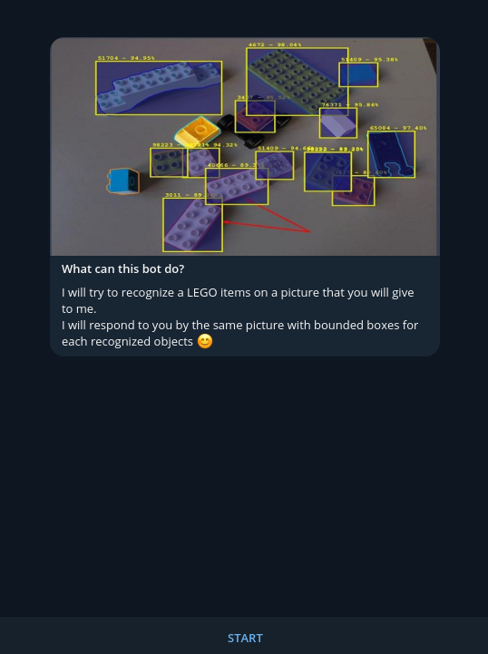\
After clicking <b>start</b> button user are able to choose two following options by using keyboard:\
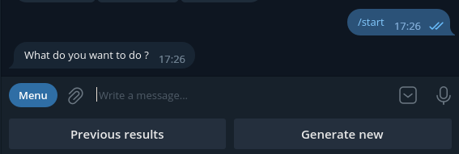\
If user will click on <b>Previous results</b> and user didn't make any request to bot,
the last one will make a response with following text and main keyboard will be still available.\
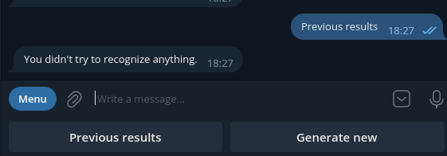\
To perform a prediction users must click on <b>Generate new</b> button.
~~User can send a message with this text and it will also work fine.~~
Afterwards bot will propose to download a **PHOTO**, not a **DOCUMENT**\
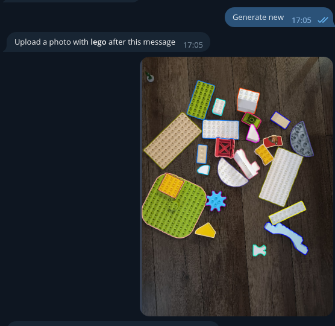\
If user will send not a photo bot will make a following answer:\
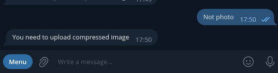\
After downloading a photo user will be asked to confirm upload or to upload another photo
by using inline keyborad\
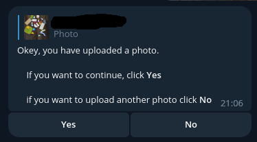\
In case user clicks **No** bot will propose upload another photo\
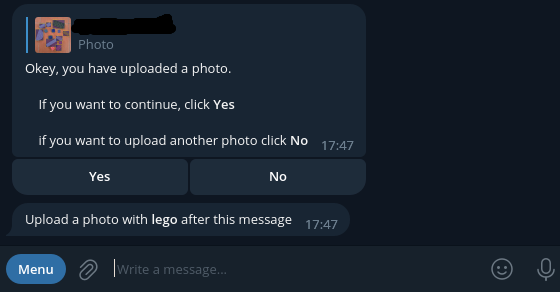\
Otherwise it will try to make a prediction. Case for success prediction:\
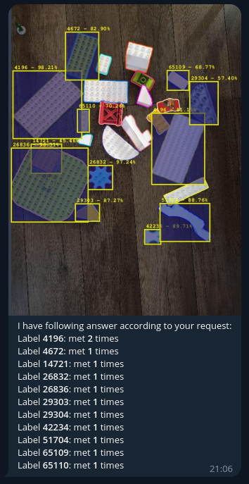\
Recognized **lego items** with boundary boxes and **lego item number** with probability
at the of boundary boxes are shown. This success response will be used in **previous results**.
If neural network is not able to recognize anything it will respond as following:\
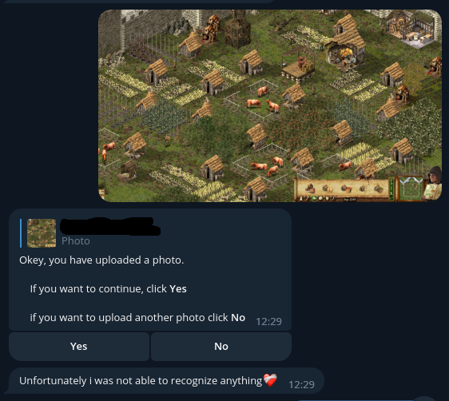\
After response bot will redirect user to main menu.
If user will have a successfull response **previous results** menu will be available.
It shows 6 responses per page separated into 3 rows with 2 columns.
It displays repsonses via inline keyboard functionality.
Each response marked in following way: _**dd-mm-yyyy HH-MM**_.
To obtain previoues response user must just click on the desired data.
First page of responses:\
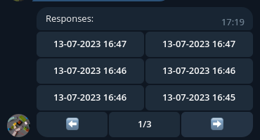\
The last page of responses:\
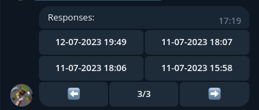
___
### Environment variables
To start this project you need define following environment variables. They are also present in .env.example
```
BOT_TOKEN=bot_token
ROBOFLOWAPI__PRIVATE_KEY=roboflow_api_private_key
ROBOFLOWAPI__PUBLISHABLE_KEY=roboflow_api_publishable_key
ROBOFLOWAPI__PROJECT_ID=roboflow_project_id
NN__NAME=neural_network_name
NN__VERSION=neural_network_version
DB__HOST=host
DB__PORT=port
DB__NAME=database_name
DB__USER=user
DB__PASSWORD=password
```
___
### Database schema
This project has four sql tables.\
Each of them presents a table in this schema.
#### Models table
This table stores data about current neural network.
#### Uploaded images table
Store data about photos that were uploaded by user. It has:
* `file_id` - field that required for downloading file that was uploaded by user.
If you upload same file a lot of times it will have different `file_id`
* `file_unique_id` - this is unique field for file. If you upload same file it will have
same `file_unique_id` but different `file_id`. Can not be used for downloading file.
* `chat_id` - required to identify user. `file_unique_id` is same for all bots in tg but
`file_id` can is stored for each bot. It means that if you will upload same file to different
bots they will have same `file_unique_id` but different `file_id` and they will not able to
access `file_id` that was uploaded not to them. Thas is why this column is mandatory.
#### Responses table
Store data about response even it was unsuccessfull.
* `uploaded_image_id` this is FK to **uploaded images table**. This is required to not
make a new prediction but generate an answer for previously uploaded image.
* `recognize_image_id` this field can be `NULL`. For example if neural network was not
able to recognize anything on the photo.
* `generated_at` used for sorting.
* `model_id` - TL;DR if neural network was updated user are able to upload photo again.
Field is required for options when user uploads file that was previously
uploaded to bot **BUT** this recognition was performed for `different` neural network model.
#### Objects table
This table store data about recognized objects. Each object store in `key: value` where
key is **object label** (number of lego item) and **amount** (total items of this lego for each response)
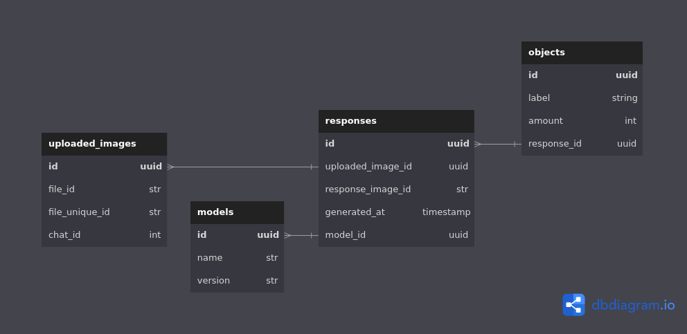
